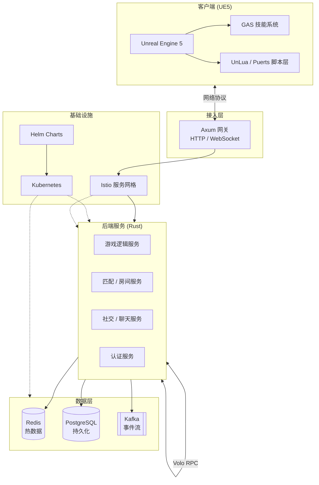

# 宿命劫：问仙

> 一款面向大型多人在线场景的 3D 仙侠题材游戏。客户端基于 Unreal Engine 5 构建，后端采用 Rust 高性能微服务架构，数据层与基础设施面向高并发、可观测、可扩展的生产环境设计。

---

## 项目简介

**宿命劫：问仙** 是一款 3D 大型在线游戏，融合开放世界探索、实时战斗与社交玩法。项目采用 **客户端 + 后端服务 + 数据层 + 云原生基础设施** 的分层架构，支持大规模玩家同服、复杂技能系统与持续内容迭代。

| 维度 | 说明 |
|------|------|
| 类型 | 3D MMO / 开放世界 |
| 引擎 | Unreal Engine 5.7 |
| 后端语言 | Rust 1.95 |
| 部署模式 | Kubernetes 1.34 + Helm 4.2 + Istio 1.30 |

---

## 技术栈

### 客户端 (Client)

| 组件 | 版本 | 用途 |
|------|------|------|
| **Unreal Engine 5** | 5.7 | 渲染、物理、动画、关卡与网络基础 |
| **GAS (Gameplay Ability System)** | UE 5.7 内置 | 技能、Buff、属性与战斗逻辑的核心框架 |
| **UnLua / Puerts** | 最新兼容 UE 5.7 | 脚本层，用于 UI、任务、配置驱动逻辑与热更新 |

### 后端核心 (Backend)

| 组件 | 版本 | 用途 |
|------|------|------|
| **Axum + Tokio** | 0.8.9 / 1.52.3 | HTTP / WebSocket 网关与异步 I/O 运行时 |
| **Volo** | 0.12.3 | 高性能 RPC 框架，用于服务间通信 |
| **Crossbeam** | 0.8.4 | 无锁并发原语，用于高吞吐消息传递 |
| **Bevy ECS** | 0.18.1 | 实体组件系统，驱动游戏状态机与逻辑调度 |

### 数据层 (Data)

| 组件 | 版本 | 用途 |
|------|------|------|
| **Redis** | 8.8 | 热数据：会话、排行榜、实时状态、分布式锁 |
| **PostgreSQL** | 18.4 | 冷数据：账号、角色、背包、任务进度等持久化存储 |
| **Kafka** | 4.3.0 | 日志采集、事件流、异步解耦与数据分析管道 |

### 基础设施 (Infra)

| 组件 | 版本 | 用途 |
|------|------|------|
| **Docker** | 29.5.1 | 服务镜像构建与本地开发环境 |
| **Kubernetes** | 1.34.8 | 容器编排、弹性伸缩、滚动发布 |
| **Helm** | 4.2.0 | Kubernetes 应用包管理，Chart 化部署与多环境发布 |
| **Istio** | 1.30.0 | 服务网格：流量治理、熔断、可观测性与 mTLS |

---

## 系统架构



### 数据流向简述

1. **客户端** 通过网关建立连接，战斗与技能逻辑在本地 GAS 执行，部分规则由服务端权威校验。
2. **网关 (Axum)** 处理鉴权、路由与长连接，将请求转发至对应微服务。
3. **微服务 (Volo RPC)** 之间通过 RPC 通信；游戏状态机由 Bevy ECS 驱动，Crossbeam 用于高性能并发通道。
4. **Redis** 缓存在线状态与高频读写数据；**PostgreSQL** 负责事务性持久化；**Kafka** 异步投递日志与领域事件。

---

## 仓库结构（规划）

```
The-Immortal-Ask/
├── client/                 # UE5 客户端工程
│   ├── Content/            # 资产与蓝图
│   ├── Plugins/            # GAS、UnLua/Puerts 插件
│   └── Scripts/            # 脚本层代码
├── server/                 # Rust 后端 monorepo
│   ├── gateway/            # Axum 网关
│   ├── game/               # 游戏逻辑服务
│   ├── common/             # 公共库（协议、错误码、配置）
│   └── proto/              # RPC / 协议定义
├── deploy/                 # 部署与运维
│   ├── docker/             # Dockerfile
│   └── helm/               # Helm Charts
│       └── immortal-ask/   # Umbrella Chart
│           ├── Chart.yaml
│           ├── values.yaml
│           ├── values-dev.yaml
│           ├── values-prod.yaml
│           └── charts/     # 子 Chart：gateway、game、auth、istio-config 等
├── tools/                  # 构建、协议生成、资源流水线
└── docs/                   # 设计文档与 API 说明
```

---

## 环境要求

> 版本基准日：**2026-05-26**。以下为各组件当前最新稳定版，预览版（如 UE 5.8 Preview）不纳入基线。

### 客户端

- Unreal Engine **5.7**（当前最新正式版）
- Visual Studio **2026**（Windows）或 Xcode **16+**（macOS）
- UnLua 或 Puerts 插件（需兼容 UE 5.7，按团队选型启用）

### 后端

- Rust **1.95.0**（Edition 2024）
- `cargo`、`rustfmt`、`clippy`
- Protocol Buffers **35.0**（`protoc` 编译器）

### 数据与基础设施

- Docker Desktop 或 Docker Engine **29.5.1**
- Kubernetes 集群 **1.34.8**（本地可用 minikube / kind）
- Helm **4.2.0**
- Redis **8.8**、PostgreSQL **18.4**、Apache Kafka **4.3.0**
- Istio **1.30.0**（生产环境，通过 Helm Chart 安装）

---

## 快速开始

### 1. 克隆仓库

```bash
git clone <repository-url> The-Immortal-Ask
cd The-Immortal-Ask
```

### 2. 启动本地依赖（Docker Compose）

```bash
docker compose -f deploy/docker/docker-compose.yml up -d
```

将启动 Redis、PostgreSQL、Kafka 等开发依赖。

### 3. 构建并运行后端

```bash
cd server
cargo build --release
cargo run -p gateway
```

### 4. 打开客户端工程

1. 用 UE5 打开 `client/TheImmortalAsk.uproject`
2. 确认 GAS 与脚本插件已启用
3. 在编辑器中 Play，或打包目标平台

---

## 开发规范

### 分支策略

- `main` — 稳定可发布分支
- `develop` — 日常集成分支
- `feature/*` — 功能开发
- `hotfix/*` — 线上紧急修复

### 代码规范

| 领域 | 规范 |
|------|------|
| C++ / UE | 遵循 Epic 编码标准，GAS 能力优先 Blueprint 可配置 |
| 脚本层 | UnLua / Puerts 仅承载 UI、任务与配置逻辑，核心战斗保持 C++ |
| Rust | `rustfmt` + `clippy`，错误使用 `thiserror` / `anyhow` |
| 协议 | 前后端共享 `.proto` 或等价 IDL，版本向后兼容 |

### 提交信息

```
<type>(<scope>): <subject>

type: feat | fix | docs | refactor | test | chore
scope: client | server | deploy | helm | proto
```

示例：`feat(server): add player login via Volo RPC`

---

## 部署

生产环境通过 **Helm + Kubernetes + Istio** 部署，所有服务以 Chart 管理，支持 dev / staging / prod 多环境 Values 覆盖。

### 前置条件

```bash
kubectl cluster-info
helm version   # 需 v4.2.0+
```

### 1. 构建并推送镜像

```bash
docker build -t registry.example.com/immortal-ask/gateway:latest -f deploy/docker/gateway.Dockerfile .
docker push registry.example.com/immortal-ask/gateway:latest
# 其余服务镜像同理
```

### 2. 安装 Istio（Helm）

```bash
helm repo add istio https://istio-release.storage.googleapis.com/charts
helm repo update

helm install istio-base istio/base -n istio-system --create-namespace
helm install istiod istio/istiod -n istio-system --wait
```

### 3. 部署应用

```bash
# 开发环境
helm upgrade --install immortal-ask deploy/helm/immortal-ask \
  -f deploy/helm/immortal-ask/values-dev.yaml \
  -n immortal-ask-dev --create-namespace

# 生产环境
helm upgrade --install immortal-ask deploy/helm/immortal-ask \
  -f deploy/helm/immortal-ask/values-prod.yaml \
  -n immortal-ask --create-namespace \
  --atomic --wait --timeout 10m
```

### 常用运维命令

```bash
# 查看发布状态
helm list -n immortal-ask
helm status immortal-ask -n immortal-ask

# 升级（改镜像 tag 或副本数等）
helm upgrade immortal-ask deploy/helm/immortal-ask \
  -f deploy/helm/immortal-ask/values-prod.yaml \
  -n immortal-ask --set gateway.image.tag=v1.2.0

# 回滚
helm history immortal-ask -n immortal-ask
helm rollback immortal-ask <revision> -n immortal-ask
```

详细运维手册见 [`docs/ops/`](docs/ops/)（待补充）。数据库设计见 [`docs/database/schema.md`](docs/database/schema.md)。

---

## 路线图

- [ ] UE5 客户端工程初始化与 GAS 战斗原型
- [ ] 网关 + 认证服务 + 角色存档
- [ ] 实时战斗房间与状态同步
- [ ] 开放世界分区与 Streaming
- [ ] 社交、公会、经济系统
- [ ] 全链路可观测（Prometheus + Grafana + Jaeger）
- [ ] 压测与弹性伸缩策略

---

## 许可证

本项目许可证待定。在正式 LICENSE 文件发布前，未经授权请勿用于商业用途。

---

## 联系方式

如有问题或合作意向，请通过 Issue 或项目维护者邮箱联系。
