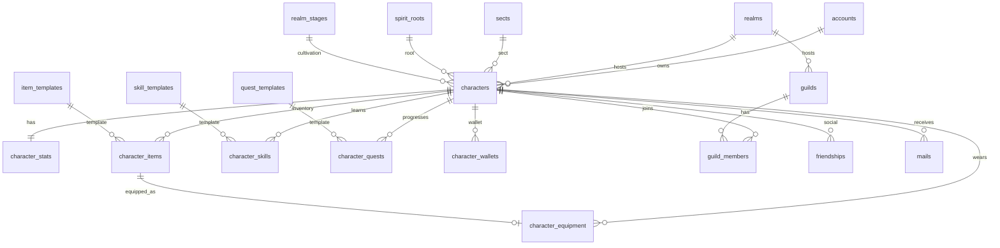

# 数据库设计 — 宿命劫：问仙

> PostgreSQL 18.4 · 持久化层（冷数据）  
> 热数据（在线状态、会话、排行榜、战斗 Buff）由 **Redis** 维护，领域事件经 **Outbox → Kafka** 投递。

## 设计原则

| 原则 | 说明 |
|------|------|
| 配置与状态分离 | `*_templates` 表存静态配置，玩家进度存独立业务表 |
| 区服隔离 | 角色名、宗门名在 `realm_id` 维度唯一 |
| 软删除 | `characters.deleted_at` 支持删角恢复窗口 |
| 扩展性 | 灵根属性、任务进度、物品词缀等用 `JSONB` 承载 |
| 枚举字段 | 原 PG ENUM 已改为 `SMALLINT`，取值约定见 migration 文件头注释 |
| 事件驱动 | `outbox_events` 保证 DB 事务与 Kafka 投递一致性 |

## 领域划分



## 表清单

### 1. 区服与配置

| 表名 | 说明 |
|------|------|
| `realms` | 区服（太虚一区等） |
| `realm_stages` | 修炼境界（炼气、筑基、金丹…） |
| `sects` | 门派配置 |
| `spirit_roots` | 灵根配置 |
| `item_templates` | 物品模板 |
| `skill_templates` | 技能模板（含 GAS Tag） |
| `quest_templates` | 任务模板 |

### 2. 账号与角色

| 表名 | 说明 |
|------|------|
| `accounts` | 平台账号（登录凭证） |
| `characters` | 玩家角色（位置、境界、门派） |
| `character_stats` | 战斗基准属性（HP/攻防等） |

**角色核心字段**

- `public_id`：对外 UUID，避免暴露自增 ID
- `realm_stage_id` + `level` + `exp`：修炼进度
- `map_id` / `pos_*`：上次下线坐标（进世界恢复）
- `attrs` JSONB：根骨、悟性、幸运等仙侠扩展属性

### 3. 物品与装备

| 表名 | 说明 |
|------|------|
| `character_items` | 背包物品实例（数量、格位、词缀） |
| `character_equipment` | 装备槽位映射 |

装备槽位示例：`weapon`, `head`, `body`, `boots`, `accessory_1`, `accessory_2`

### 4. 技能与任务

| 表名 | 说明 |
|------|------|
| `character_skills` | 已解锁技能及等级 |
| `character_quests` | 任务状态与 `progress` JSONB |

`skill_templates.gas_tag` 与 UE5 GAS Ability 名称对应，便于客户端表现与服务端校验对齐。

### 5. 经济

| 表名 | 说明 |
|------|------|
| `character_wallets` | 多币种钱包 |

内置币种代码：

- `spirit_stone` — 灵石（通用货币）
- `merit` — 功德
- `sect_contribution` — 宗门贡献

### 6. 社交

| 表名 | 说明 |
|------|------|
| `guilds` | 宗门/公会 |
| `guild_members` | 成员与职位 |
| `friendships` | 好友 / 黑名单 |
| `mails` | 系统邮件与附件 |

### 7. 审计与事件

| 表名 | 说明 |
|------|------|
| `audit_logs` | 操作审计 |
| `outbox_events` | 事务 Outbox（Kafka 投递） |

## Redis 热数据（不在 PG 中）

| Key 模式 | 用途 |
|----------|------|
| `session:{token}` | 登录会话 |
| `online:{realm_id}` | 在线玩家集合 |
| `char:state:{id}` | 实时战斗态、临时 Buff |
| `rank:{type}:{realm_id}` | 排行榜 ZSET |
| `lock:trade:{id}` | 交易分布式锁 |

## 迁移与初始化

```bash
# 1. 建库建用户（GUI 客户端：先连 postgres 库，执行 000）
#    Docker Compose 已自动创建时可跳过
psql -U postgres -d postgres -f deploy/database/migrations/000_create_database.sql

# 2. 表结构（GUI 客户端：先切换到 immortal_ask 库，再执行 001）
psql -U immortal -d immortal_ask -f deploy/database/migrations/001_initial_schema.sql

# Docker Compose 首次启动仅自动执行 001
docker compose -f deploy/docker/docker-compose.yml up -d postgres
```

### SMALLINT 枚举约定

| 字段域 | 取值 |
|--------|------|
| `account.status` | 1=active 2=banned 3=pending |
| `characters.gender` | 1=male 2=female 3=unknown |
| `guild_members.role` | 1=leader 2=elder 3=member |
| `character_quests.status` | 1=locked 2=active 3=completed 4=failed 5=abandoned |
| `mails.status` | 1=unread 2=read 3=claimed 4=deleted |
| `item_templates.bind_type` / `character_items.bind_state` | 1=none 2=pickup 3=equip |
| `friendships.status` | 1=pending 2=accepted 3=blocked |

## 索引策略（后续迭代）

- 高频查询：`characters(account_id)`, `character_items(character_id)`
- 排行榜、在线列表走 Redis，PG 仅做快照与历史
- 大表分区：按 `realm_id` 或时间对 `audit_logs` 做 RANGE 分区（上线后按需添加）

## 种子数据

初始 migration 已包含：

- 1 个区服「太虚一区」
- 4 个境界阶段、3 个门派、3 种灵根
- 示例物品、技能、任务模板
