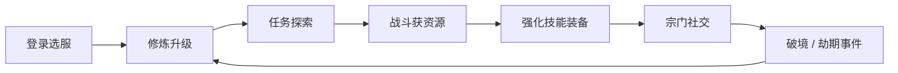

# 宿命劫：问仙 — 游戏设定文档

> 版本：0.1.0 · 更新日期：2026-05  
> 本文档描述世界观、核心玩法与数值框架，供策划、客户端与后端对齐设计意图。  
> 数据表与枚举约定见 [`database/schema.md`](database/schema.md)。

---

## 1. 游戏概述

| 项目 | 说明 |
|------|------|
| 名称 | **宿命劫：问仙** |
| 类型 | 3D 仙侠 MMORPG / 开放世界 |
| 平台 | PC（首版），后续可扩展主机/移动端 |
| 视角 | 第三人称 |
| 核心体验 | 修仙成长 · 宗门社交 · 开放探索 · 实时战斗 |
| 标语 | *凡人问道，仙途始于此* |

玩家自凡尘踏入修真界，在区服「太虚」中择灵根、入宗门、破境界，于大世「宿命劫」中抉择道途——是顺天应命，还是以问仙之心逆天改命。

---

## 2. 核心主题：宿命劫

### 2.1 世界观命题

天地有劫，劫生因果。每一修士降生皆带一缕「命纹」——记录其前世残念、今世机缘与未竟之愿。当界域灵气潮汐达到顶峰，**宿命劫**降临：天魔裂隙、古修遗迹、宗门气运之争同时显现，迫使修士在**顺命**与**问命**之间做出选择。

- **顺命**：遵循命纹指引，稳妥修行，机缘可预期，但上限受限于根骨与气运。
- **问命**：以心证道，主动改写命纹节点，风险极高，可能触发隐藏剧情、独属功法或天罚。

游戏名中的「问仙」，即对既定宿命的发问：**我命由天，还是由我？**

### 2.2 叙事结构

| 层级 | 内容 |
|------|------|
| **主线** | 拜入仙门 → 筑基立道 → 金丹定命 → 卷入宿命劫 |
| **宗门线** | 三大门派各有传承秘辛，与劫中「气运柱」相连 |
| **散修线** | 不入宗门亦可修行，但缺少资源与庇护，机缘更险 |
| **劫期事件** | 周期性世界事件（Boss、资源争夺、限时副本） |

首版可玩内容聚焦：**账号登录 → 创角选服 → 炼气修行 → 青云宗主线「拜入仙门」**。

---

## 3. 世界与区服

### 3.1 界域：太虚

当前开放界域为 **太虚**。太虚并非单一星球，而是一片被上古阵法分割的「浮陆群」——各浮陆以灵脉相连，修士通过传送阵、飞剑或宗门大阵往来。

首服命名：**太虚一区**（代码 `s1`），后续可扩展二区、跨服劫场等。

### 3.2 主要地理（规划）

| 区域 ID | 名称 | 定位 | 开放阶段 |
|---------|------|------|----------|
| 1001 | 落霞村 | 新手村，凡人聚落 | 首版 |
| 1100 | 青云山 | 青云宗山门 | 首版 |
| 1200 | 玄冥泽 | 玄冥阁势力范围 | EA |
| 1300 | 烈阳荒漠 | 烈阳谷势力范围 | EA |
| 2000 | 劫云裂隙 | 宿命劫世界事件区域 | 后续 |

角色下线时记录 `map_id` 与坐标，再次登录于原位置或安全点复活（具体规则由服务端权威判定）。

### 3.3 区服规则

- 单账号在同一区服最多创建 **3** 名角色（可配置 `realms.max_characters`）。
- 角色名在区服内唯一，删除角色进入软删除窗口，超期方可复用名称。
- 区服可配置开服时间、是否开放注册。

---

## 4. 修炼体系

### 4.1 境界划分

修真以「境」为大、以「层/期」为小。境界决定等级上限、可学技能阶位与部分地图准入。

| 阶段 ID | 名称 | 大境界 | 所需累计经验 | 等级上限 |
|---------|------|--------|--------------|----------|
| 1 | 炼气一层 | 炼气 | 0 | 10 |
| 2 | 炼气二层 | 炼气 | 1,000 | 10 |
| 3 | 筑基初期 | 筑基 | 10,000 | 20 |
| 4 | 金丹初期 | 金丹 | 100,000 | 30 |

**突破规则（设计意图）**

1. 经验满当前境上限后，需完成「破境任务」或「破境试炼」方可晋入下一阶段。
2. 突破失败可能损失部分经验或触发负面状态（心魔），可通过丹药、宗门祈福缓解。
3. 大境界突破（如炼气→筑基）为关键节点，与主线、灵根、门派技能树联动。

### 4.2 角色等级与经验

- 等级 `level` 在当前 `realm_stage_id` 内成长，不超过该阶段 `max_level`。
- 经验来源：主线/支线任务、击杀妖兽、采集、日常、宗门贡献活动。
- 战力 `combat_power` 为展示与排行用的综合评分，由装备、技能、境界、属性加权计算。

### 4.3 扩展属性（`characters.attrs`）

| 属性 | 说明 | 影响 |
|------|------|------|
| 根骨 | 体质天赋 | 生命、防御成长 |
| 悟性 | 领悟速度 | 技能升级、功法参悟 |
| 幸运 | 气运 | 掉落、暴击、奇遇触发 |
| 神识 | 精神强度 | 法力、控制抗性 |
| 杀伐 | 战意积累 | 部分门派技能加成 |

创角时可随机或按灵根权重生成基础值；后续通过丹药、奇遇、宗门秘传提升。

---

## 5. 灵根

灵根决定元素亲和、修炼速度与部分功法准入，是「问命」系统的核心变量之一。

| ID | 名称 | 元素 | 稀有度 | 说明 |
|----|------|------|--------|------|
| 1 | 杂灵根 | 混杂 | ★ | 最常见，各元素亲和均衡，无明显短板也无专精 |
| 2 | 火灵根 | 火 | ★★★ | 火系伤害与暴击倾向，适合烈阳谷一脉 |
| 3 | 天灵根·金 | 金 | ★★★★★ | 极稀有，金系与剑修契合，青云宗高阶功法解锁条件 |

**设计规则**

- 创角时通过「测灵大典」仪式抽取或选择（首版可简化为三选一或随机）。
- 灵根可随「宿命劫」稀有事件发生蜕变（变异灵根），属后期内容。
- 技能与装备元素标签需与灵根匹配时，获得伤害或冷却加成。

---

## 6. 门派（宗门）

门派提供技能传承、日常任务、贡献商店与社交归属。首版种子数据包含三大门派：

| ID | 编码 | 名称 | 主属性 | 定位 |
|----|------|------|--------|------|
| 1 | qingyun | **青云宗** | 风/金 | 剑修正统，平衡攻防，适合新手主线 |
| 2 | xuanming | **玄冥阁** | 水 | 控场与生存，团队辅助核心 |
| 3 | lieyan | **烈阳谷** | 火 | 爆发输出，高风险高回报 |

### 6.1 入门条件

- 完成主线任务「拜入仙门」后，在对应山门 NPC 处选择门派。
- 部分高阶收徒需灵根、境界或隐藏任务满足条件。
- 退出门派消耗资源并进入冷却，防止频繁跳槽（具体数值待平衡）。

### 6.2 宗门 vs 公会

| 概念 | 说明 |
|------|------|
| **门派（sect）** | 系统配置阵营，决定技能与剧情，单角色同一时间仅属一门派 |
| **宗门/公会（guild）** | 玩家自建组织，负责团队活动、领地与社交，与系统门派正交 |

玩家可：隶属「青云宗」+ 加入玩家公会「某某盟」，两者并存。

---

## 7. 角色与身份

### 7.1 账号与角色

- **账号（accounts）**：平台登录凭证，用户名 + 密码，可选绑定邮箱。
- **角色（characters）**：区服内的修真化身，承载全部游戏进度。

### 7.2 创角流程（目标体验）

1. 登录账号（已实现客户端登录/注册 UI）。
2. 选择区服（默认太虚一区）。
3. 输入道号（角色名）、选择性别。
4. 测灵根 → 预览初始属性。
5. 进入落霞村，开启主线。

### 7.3 性别

| 值 | 含义 |
|----|------|
| 1 | 男 |
| 2 | 女 |
| 3 | 未知 / 不便透露 |

仅影响外观与少量对话，不影响战斗数值。

---

## 8. 战斗与技能

### 8.1 战斗风格

- **实时动作战斗**，客户端 UE5 **GAS（Gameplay Ability System）** 驱动技能表现与本地预测。
- 服务端权威校验：伤害、冷却、状态、死亡与掉落。
- 支持 PvE（妖兽、副本）、后续 PvP（劫场、宗门战）。

### 8.2 基础属性（`character_stats`）

| 属性 | 说明 |
|------|------|
| HP | 生命值 |
| MP | 法力值 |
| ATK | 攻击力 |
| DEF | 防御力 |
| 暴击率 / 暴击伤害 | 输出波动 |
| 移动速度 | 探索与走位 |

Buff、临时加成存 Redis 热数据，持久化基准值存 PostgreSQL。

### 8.3 技能示例

| 编码 | 名称 | 类型 | 元素 | 冷却 | GAS 标识 |
|------|------|------|------|------|----------|
| sword_qi | 御剑诀 | 主动 | 金 | 3s | GA_SwordQi |
| fire_ball | 火球术 | 主动 | 火 | 5s | GA_FireBall |

技能类型还包括：被动（passive）、绝学（ultimate）等，详见 `skill_templates.skill_type`。

### 8.4 元素克制（建议）

```
火 → 金 → 木 → 水 → 火
（相克链循环，无克制时伤害 ×1.0，克制 ×1.25，被克 ×0.8）
```

风、雷等扩展元素在后续版本加入。

---

## 9. 物品与装备

### 9.1 物品分类

| 分类 | 说明 | 示例 |
|------|------|------|
| material | 材料 | 下品灵石 |
| consumable | 消耗品 | 回春丹 |
| equipment | 装备 | 玄铁剑 |
| quest | 任务道具 | — |

### 9.2 品质

品质 1–7 级，由低到高：凡品 → 灵品 → … → 仙品（具体色名与 UI 待美术定稿）。

### 9.3 绑定规则

| 值 | 规则 |
|----|------|
| 1 none | 可自由交易 |
| 2 pickup | 拾取后绑定 |
| 3 equip | 穿戴后绑定 |

### 9.4 装备槽位

`weapon` · `head` · `body` · `boots` · `accessory_1` · `accessory_2`

装备可带词缀（`affixes` JSON），支持随机属性与强化系统（后续版本）。

---

## 10. 经济系统

### 10.1 货币

| 代码 | 名称 | 用途 |
|------|------|------|
| spirit_stone | 灵石 | 通用货币，交易、修理、学习技能 |
| merit | 功德 | 劫期兑换、特殊商店 |
| sect_contribution | 宗门贡献 | 门派商店、传功长老处兑换 |

### 10.2 经济循环

```
任务 / 妖兽 / 采集 → 灵石 & 材料
        ↓
    强化 / 炼丹 / 学习技能
        ↓
    宗门贡献 & 功德 → 稀有功法 / 外观
```

拍卖行、玩家面对面交易属后续版本；首版以 NPC 商店与邮件附件为主。

---

## 11. 任务系统

| 类型 | 编码示例 | 说明 |
|------|----------|------|
| main | main_001 拜入仙门 | 推动主线与境界解锁 |
| side | — | 区域探索、NPC 轶事 |
| daily | daily_gather 采集灵草 | 日常资源产出 |
| sect | — | 门派专属 |

任务状态：锁定 → 进行中 → 完成 / 失败 / 放弃。  
进度与分支选择存 `character_quests.progress` JSON。

**首版主线「拜入仙门」**：引导玩家至青云山，完成入门试炼，奖励经验与回春丹 ×5。

---

## 12. 社交系统

| 功能 | 说明 |
|------|------|
| 好友 | 申请 / 接受 / 拉黑 |
| 公会 | 创帮、职位（掌门/长老/弟子）、团队副本 |
| 邮件 | 系统奖励、交易附件、公告 |
| 聊天 | 世界 / 门派 / 队伍 / 私聊（经 gateway WebSocket） |

好友与黑名单状态见 `friendships.status`：pending / accepted / blocked。

---

## 13. 核心玩法循环



**单次会话典型路径（15–30 分钟）**

1. 登录 → 领取日常 → 完成 1–2 个任务  
2. 野外采集或副本获取灵石、材料  
3. 回城炼丹/修理/学技能 → 与宗门成员组队  
4. 下线前于安全区登出，保存坐标  

---

## 14. 宿命劫（世界事件）— 后续版本

当服务器开启「劫期」时：

- 地图出现 **劫云裂隙**，刷新精英妖兽与限时宝箱  
- 三大门派争夺 **气运柱**，贡献转化为全服 Buff  
- 个人命纹触发 **独属奇遇**（问命路线核心）  

劫期结束根据贡献发放 merit、稀有材料与称号。

---

## 15. 与工程实现的对应

| 设定模块 | 客户端 | 服务端 | 数据 |
|----------|--------|--------|------|
| 登录注册 | AuthWidget / Gateway HTTP | gateway `/api/v1/auth/*` | accounts |
| 选服创角 | 待实现 | 待实现 | realms, characters |
| 战斗技能 | GAS Ability | game 服务校验 | skill_templates, Redis 战斗态 |
| 背包装备 | UI + 本地预测 | 权威背包服务 | character_items |
| 任务 | 脚本/UI 驱动 | 任务状态机 | character_quests |
| 社交邮件 | WebSocket | social 服务 | friendships, mails |

---

## 16. 美术与音频基调（建议）

| 维度 | 方向 |
|------|------|
| 视觉 | 东方仙侠、水墨与写实结合，昼夜与灵气潮汐变化 |
| UI | 简洁道韵风格，登录界面深色底 + 金色点缀（已实现首版） |
| 音乐 | 古筝、箫、低频鼓点；战斗时加入弦乐与电子低频 |
| 文案 | 半文半白，关键剧情可全文言配音 |

---

## 17. 版本范围（0.1 里程碑）

**本阶段目标（与 README 路线图对齐）**

- [x] 账号登录 / 注册（gateway + 客户端 UI）
- [ ] 选服与创角
- [ ] 落霞村 + 主线「拜入仙门」
- [ ] 炼气境战斗原型（御剑诀、火球术）
- [ ] 背包、装备、基础 NPC 商店

**明确不在 0.1 范围**

- 跨服劫场、拍卖行、洞府建造  
- 灵根变异、退宗转投完整规则  
- 完整 PvP 排位  

---

## 18. 术语表

| 术语 | 含义 |
|------|------|
| 道号 | 角色名 |
| 灵根 | 元素天赋，决定修炼方向 |
| 境界 | 炼气、筑基、金丹等大阶段 |
| 灵石 | 基础货币 |
| 宿命劫 | 周期性大世界事件，核心 IP 概念 |
| 命纹 | 角色隐藏命运线，驱动问命玩法 |
| 区服 | 独立玩家池，如太虚一区 |

---

## 19. 文档维护

- 数值平衡、任务文案、地图 ID 以数据库 migration 与配置表为准。  
- 重大设定变更请同步更新本文档，并在 PR 中 `@` 相关模块负责人。  
- 关联文档：[`database/schema.md`](database/schema.md)、[`../README.md`](../README.md)

---

*「道可道，非常道。名可名，非常名。」—— 问仙之路，始于一步。*
